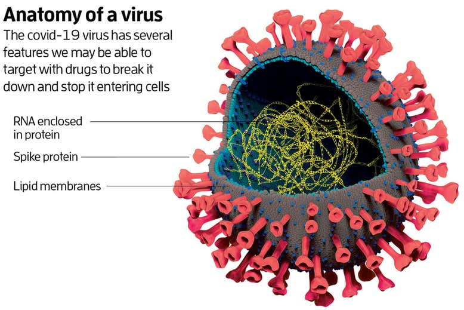
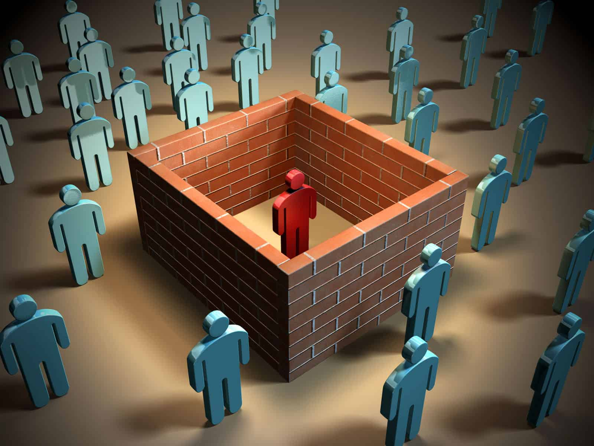
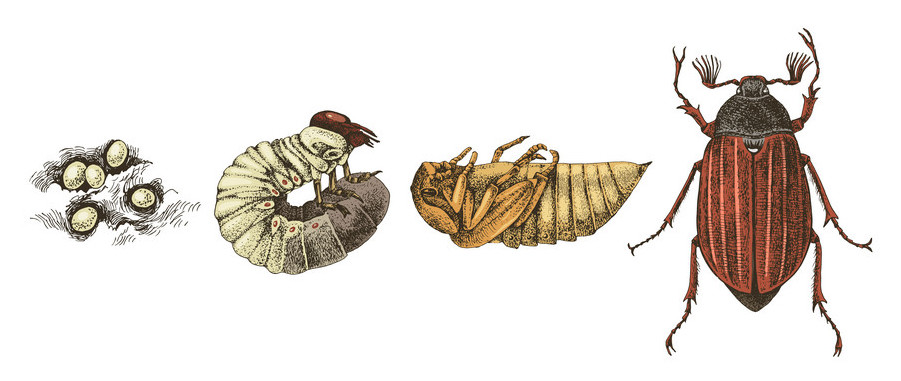

## Adapting to Change

How my routine has changed during the COVID-19 pandemic is by having to self quarantine and practice social distancing with others. As a frequenter of coffee shops, it's sad to not have a busy atmosphere for me to reach peak productivity in. It's also sad to see friends go back home from the dorms and miss out on hot yoga sessions at the studio.

Being that my family lives in California, they're mostly weathering the pandemic we're in by themselves. Although I hold a job as a grader, I can still meet my obligations as usual by just grading at home and meeting with my advisor over Zoom/Discord. And Although Covid hasn't really affected my experience in ICS 314, it has made me less productive due to having to self isolate. I feel like isolation makes me want to do less but I still make it my point to try my best.

I found that we as a community can come together to do good and stay safe for one another. I think on a economic level, history is writing itself day by day and I hope that after all this I can still finish the semester, find a job, and still be alive. I've also learned that my family and friends have been nothing but supportive, constantly calling me and informing me about themselves and things I wasn't aware of in this unsure climate we find ourselves in.

## Moving Forward
On moving forward successfully, I just need to practice more. I think that I can feel like sometimes, I understand what's going on in this class but it's a false security. Additionally, I feel like I'm quite close to the end of the semester and need to finish strong to graduate. I can't let something like Covid stop me from doing good in this class, let alone any of my other ones.
