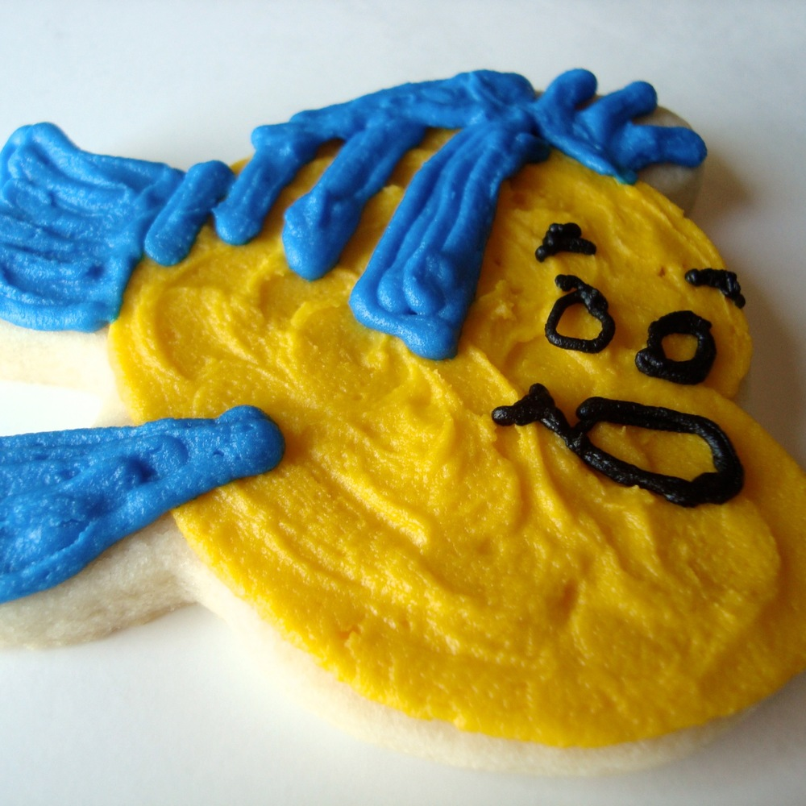

## Fish-flavored Cookies... Yum!

One of my hobbies is baking, and one of my favorite things to bake are chocolate chip cookies.  I know, I know! How basic is that? But did you know that there's a whole science to it? For example, adding too much flour will make your cookies extremely dry and puffy-looking; and adding too much butter will cause your cookies to become spread out and oily; and using a Silpat baking mat that you use to cook every other dish (like that baked salmon from the other night) can give your cookies a fishy flavor--even though you've scrubbed and soaped it and ran it through the dishwasher twice! And so you throw them away and end up serving those pre-packaged Little Debbie cookies to your friends and family at the church potluck. How embarrassing. From the standard ingredient eggs-flour-butter ratio to the type of material you bake your cookies on, cookie-making is a lot like chemistry, and let's be honest: common sense. 

## Cookie Cutters Are Design Patterns Too

Design patterns describe recurring problems in the design environment that, over time, has been picked apart to reveal the core issue and provide a solution that will work time and time again for every variant of that problem. 

Like a recipe for a cookie, design patterns lets a person create or build something by following an approach that has already been proven to work. A person who has never baked a cookie before might first follow a recipe from a cookbook, and as they get more experience with ingredient ratios and their kitchen, they might decide to be a little more creative and put some walnuts in their recipe, and make a chocolate chip walnut cookie. Similarly, a person who has never coded but has an idea for an app might try to follow a tutorial on creating an app, and from there they can get to the point where they're comfortable enough to implement their own app idea, and go through the process enough times to finally break free from the design pattern and assume creative reign in their projects.

# My Coding Cookbook 

In my opinion, the ICS 314 course is a perfect example of how I have used Design Patterns in my code. Throughout the course, we were taught how to use certain Frameworks like Semantic UI and more recently, Meteor. Each activity in its respective module in the course has given us a thorough explanations of each step in the process to achieve a goal.

# Conclusion

While design patterns seem to be a promising approach to the software engineering design process, it merely serves as a guide to follow until you're comfortable enough to do things on your own. Its applications surpass software engineering and 
