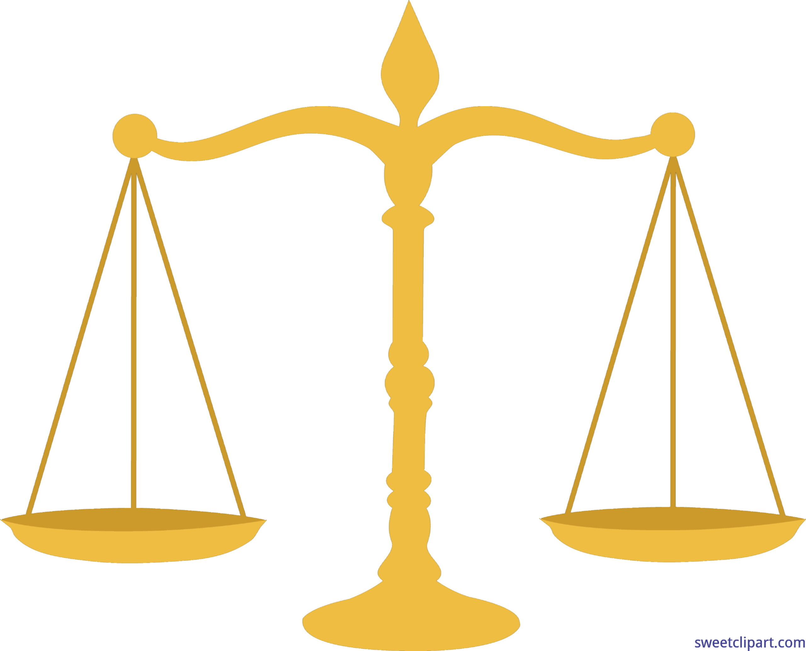
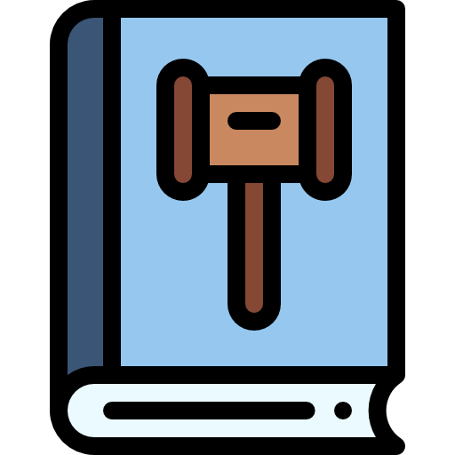

# Ethics

Ethics in the philosophical sense can be defined as a system of moral principles that governs one's actions. One of the most common principles that dates back to ancient times, and is prevalent in almost all cultures, is the maxim of reciprocity. Though this principle comes in many variations, it fundamentally teaches one not to treat others the way they wouldn't want to be treated. Many organizations and institutions today have instilled codes of conducts based on such moral principles in an effort to ensure the well-being of all parties involved. I feel it's important that such codes be enforced due to the fallable nature of human judgment.

## Software Engineering

Promoting responsible conduct is important in the development of any project that is catered for public use, including in software engineering where something as seemingly harmless as an app with a cute graphical UI is deployed. But what ethical issues could arise in such an app? In foundations, we the second case study, Errand Whiz, presents us with the scenarario in which a user downloads a third-party app that collects and sells their private information unbeknownst to them, for the purpose of targeted advertising. Ethical considerations in software engineering seem to be prevalent with violations of privacy, where information collected from consumers can be used against the same consumers in an attempt to influence their decision-making.

# Case Study: The Code I'm Still Ashamed Of

The Code I'm Still Ashamed Of presents the reader with the personal story of Bill, a  software developer who was assigned to create a website for an interactive marketing firm to advertise prescription drugs directly to consumers. One of the requirements for the client's website was a quiz that endorsed their own prescription drug specifically to teeneage girls. In an unfortunate turn of events, Bill is informed that a young girl who had taken the client company's drug, had died as a result of the drug's side effects that included severe depression and suicidal thoughts. 

Many other young girls could have been harmed by this website, as a result of Bill's failure to consider the ethical requirements of delving into this project--although Bill couldn't be entirely blamed for this due in part to his own naiveté as a young software developer who was blinded by the hustle. I feel like it is a very easy pit to fall into, and as engineers we should do our best to consider the implications of undertaking any new project. Perhaps having a network of other engineers who can review your work can help you think twice about the societal impact of your project.

# Conclusion

Overall, I feel that despite any codes of conduct, every developer should greatly consider the ethical aspect of their work. This is important because in a way, you do hold a lot of power over the consumer when they use your app, such as in the case of targeted adversting, where the consumer can be led to make certain decisions. 

