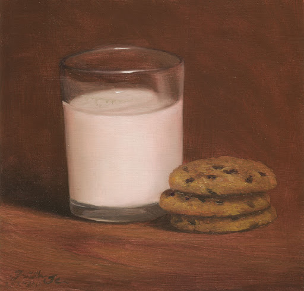

## Good times

As I look back on the time I've spent on this course, I've come to find that it has given me a lot of experience and knowledge that I intend on using in the future. Of all the modules in this course, I feel that the three most important, at least to me, were Configuration Management, Design Patterns, and Ethics in Software Engineering.

## On Bad Github Usage and Configuration Management

Configuration management provides users with the tools to keep their project organized and allows seamless collaboration with teams. It is also one of the most valuable skills I could take away from this course. Before this course, the only Git commands I knew were git commit and git push. I also didn't know about version control and branching, and so whenever I needed to update my code, I would simply copy-paste the new version onto the same file in my repo. I realize now that not only did this take up a lot of time, but I also wasn't using Github the way it was intended to, and looking back, that's pretty sad, and I wish I knew about it earlier.

## On Design Patterns
Another important lesson I've learned from this course is on design patterns. Design patterns are essentially pre-defined steps that one takes in their approach to solving a problem. 

## On Software Engineering Ethics

Another important takeaway from this course is ethics. In a technical field like software engineering, it is easy to overlook the societal impact of your work. Something as seemingly harmless as web design can take a turn for the worst if the company has malicious intentions, for example. 

## Pushing Forward

With the sudden cessation of on-site classes due to the (ongoing) COVID-19 pandemic, to say that this was an interesting semester is an understatement. Though I can't say the same for other courses, Tt wasn't too difficult to transition from on-site to online classes since instructors were still accessible through Zoom and Slack.
