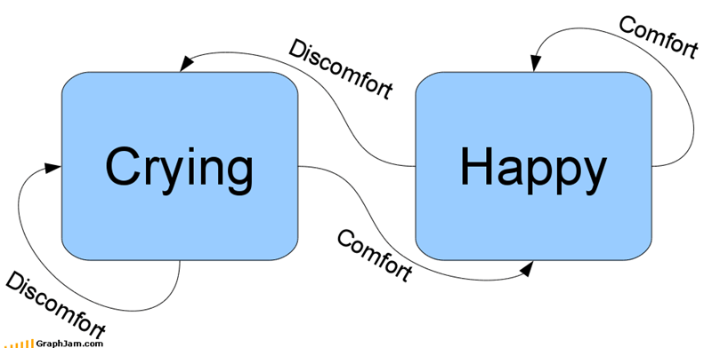

## The One That Got Away

For the majority of my life, I didn't know what "computer science and engineering" really entailed.  My first brush with computer science was when I was 18. I dated a boy who majored in computer science and engineering. He was a genius. Not to mention he played the bass guitar. I saw him struggle through his classes as I lived among the blissful ignorance of the technologically naive. I never imagined I would ever deal with the classes he would lose sleep for, so a career in computer science or anything of the like was out of the question for me at the time. Fast-forward many years later in my first coding class as a mechanical engineering major, I found that I  enjoyed the challenge and the satisfaction that comes with the problem-solving process and I subsequently changed my major to computer engineering.

## The Present State

The computer engineering curriculum has continously humbled me in my academic pursuits. I came into the program believing I could get by with absolutely no collaboration. I was gravely mistaken. Collaborating with other students has played a major role in not only fostering camaraderie, but also in learning. For the most part, the EE/ENGR x96 project courses that the Department of Engineering offers has made it a requirement for students to collaborate with each other. In communicating with other students, I discovered two important things: The first is that most people are friendly and are usually willing to help, and the second is that everybody knows something you don't know. 

## The Future
Academically, I’m interested in how hardware and software interact, as well as the various applications of field-programmable gate arrays (FPGAs). I hope to use my knowledge of algorithms and computer engineering to pursue a career in FPGA technologies. 
