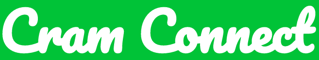
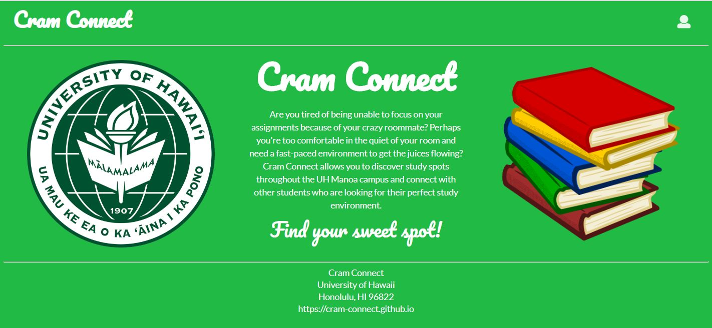
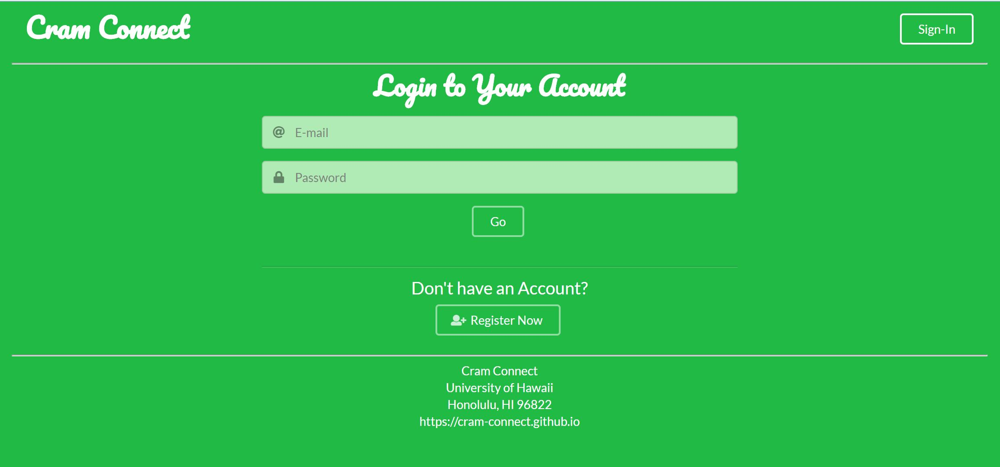
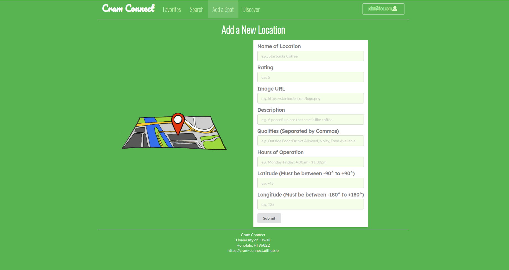

## Cram Connect: Overview

Cram Connect is a web application that helps college students find their perfect place to study near the UH Manoa campus. Listed below are the site functionalities:
* Users can add new locations, and review and rate these locations.
* Users can discover new random locations.
* Users can tailor their profiles according to their favorite study spots and what they like about these "cram spots"

 
Our site makes it easy for students to find the perfect study spot to make learning fun.

Our group divided the work using issue driven project management, which helped us ensure that each person's assigned tasks were completed and that everybody was on the same page.

The tasks I was assigned were to create the landing, sign-in, add location pages and create the favorites page.

<a href="https://cram-connect.github.io/"><i class="large github icon"></i>View the Cram Connect Project Page</a>

<a href="https://github.com/cram-connect/app"><i class="large github icon"></i>View the Cram Connect Repository</a>
